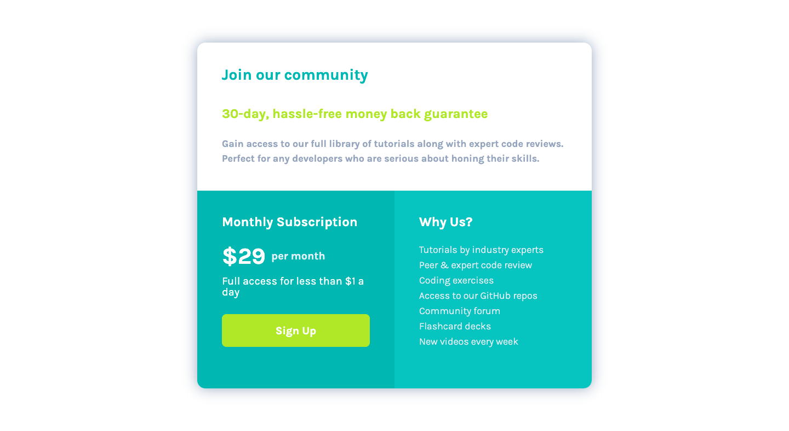

 **SOFTWARE ENGINEERING IMMERSIVE**

# Sass {Syntactically Awesome Style Sheet}


## Prerequisites
- Proficiency in CSS
- Proficiency in a programming language (i.e. Javascript, Ruby or Python)

## Objectives

By the end of this lesson students will be able to:

-   [ ] Setup Sass for their web application
-   [ ] Understand the benefits of Sass
-   [ ] Develop an Application using Sass

<br/>

## What is Sass?

Sass is a feature-rich CSS extension language and pre-processor for creating styled variables, mixins, and modules. Sass also enables CSS selector nesting and inheritance.

It incorporates the basic benefits of programming languages into your stylesheets.


#### Variables
> If you've ever wanted one place to change the font-family or color theme of your app, this is the feature you want to use.

<details>
<summary>Variables Example</summary>

```sass
$helvetica-font: Helvetica, sans-serif
$primary-color: #333

body
  font-family: $helvetica-font
  color: $primary-color
```
</details>

<br/>

#### Mixins 
> If you have ever wanted to share blocks of styling with multiple CSS selectors without repeating CSS Selectors throughout your styles, this is the feature you want to use.

<details>
<summary>Mixins Example</summary>

```sass
=color-box-style($bg-color)
  width: 200px
  height: 200px
  background: $bg-color
  
.red-box
  +color-box-style(red)
  color: cyan

.green-box
  +color-box-style(green)
  color: purple
```
</details>

<br/>

#### Functions (from built-in sass modules)
> Incorporate pre-built functions into your styles easily. https://sass-lang.com/documentation/modules

<details>
<summary>Complement Function Example (Color Module)</summary>

```sass
<!-- Mixin -->
=color-box-style($bg-color)
  width: 200px
  height: 200px
  background: $bg-color

<!-- Variables -->
$color-1: red
$color-2: green

<!-- Styles -->
.color-box-1
  +color-box-style($color-1)
  color: complement($color-1) // <- function
.color-box-2
  +color-box-style($color-2)
  color: complement($color-2) // <- function

```
</details>

<br/>

#### @Imports
> The @import rule enables you to modularize your style code. Import multiple Sass stylesheets into another (similar to how you import react components)

<details>
<summary>@import Example</summary>

```sass
// _mixins.sass

=color-box-style($bg-color)
  width: 200px
  height: 200px
  background: $bg-color
```
```sass
// _variables.sass

$color-1: red
$color-2: green
```
```sass
// main.sass
@import 'mixins', 'variables'

.color-box-1
  +color-box-style($color-1)  // <- mixin and variable
  color: complement($color-1) // <- function and variable
.color-box-2
  +color-box-style($color-2)
  color: complement($color-2) // <- function

```
</details>

<br/>


#### THERES SO MUCH MORE
[Sass Docs](https://sass-lang.com/documentation)

<br/>

## Why Develop with Sass?


- DRY / Organized styles
- Scalable / Modular
- Maintainable
- It's popular!

> Use Variables and Mixins to practice DRY code. When working on larger projects, build smaller - more practical stylesheets that take advantage of nested syntax (grouping like content). @import them into one .sass stylesheet for a modular application. These benefits mean that it becomes easier to manage your application content.

<br/>

### Sass vs CSS

- Developing with multiple Sass files means the browser still only makes one HTTP request for a stylesheet. Sass outputs all css into one .css file
    - Developing with multiple CSS files means the website visitor's browser is making multiple HTTP requests 
- Sass is great for larger projects and teams
- Less syntax. Scss will look more familiar because it uses **{ }** and **;**
- You can customize Bootstrap 4 with Sass. https://getbootstrap.com/docs/5.0/customize/sass/

<br/>

## Setup
1. Install Sass via the CLI (w/ Homebrew)
    * brew install sass/sass/sass

1. Start web app project. (i.e. create-react-app)
1. (Recommended) create a folder called **'styles'** in your src folder (if a react-app)
1. Inside the styles folder, create two files: 
    * main.sass
    * main.css
1. Compile Sass to CSS. 
    * Install a Live Sass Compiler Extension (**ritwickdey.live-sass**)   
    OR
    * inside the styles folder, run "sass --watch *input-file.sass* *output-file.css*"
    >'input-file.sass' is the main.sass file and 'output-file' is the main.css file
1. Install a Sass Indentation and Syntax Highlighting Extension (**syler.sass-indented**)

<br/>

## You Do: 
> 1. Fork (optional)
> 1. Clone this repo
> 1. cd into the ***client*** folder and run **npm i** 
> 1. Follow the setup Sass directions above and try to create this landing page using Sass syntax 



## What is Scss {Sassy CSS}?

- **Sass** files end in the _.sass_ extension
- **Scss** files end in the _.scss_ extension

> Both need to be compiled to CSS
> Scss and Sass are essentially the same. Below are some of the differences in syntax.

#### Sass Syntax 

<details>
<summary>Example:</summary>

```sass
@import "section"

html, body
  margin: 0

.app
  background: blue
  color: white
  height: 100vh
  padding: 15px
  box-sizing: border-box
  display: flex
  flex-direction: column
  align-items: center

  h1 
    font-size: 24px
    font-weight: 700
```
</details>

<br/>

#### Scss Syntax Example:
<details>
<summary>Example:</summary>

```scss
@import "section"

html, body{
  margin: 0;
}
.app{
  background: blue;
  color: white;
  height: 100vh;
  padding: 15px;
  box-sizing: border-box;
  display: flex;
  flex-direction: column;
  align-items: center;

  h1 {
    font-size: 24px;
    font-weight: 700;
  }
}
```
</details>

<br/>

#### CSS Syntax Example:

<details>
<summary>Example:</summary>

```css
.section {
  width: 100vw;
  height: 50vh;
  background: black;
  display: flex;
  justify-content: center;
  align-items: center;
}

html, body {
  margin: 0;
}

.app {
  background: blue;
  color: white;
  height: 100vh;
  padding: 15px;
  box-sizing: border-box;
  display: flex;
  flex-direction: column;
  align-items: center;
}

.app h1 {
  font-size: 24px;
  font-weight: 700;
}
```
</details>

<br/>

## Bootstrap 4 customization w/ Sass

https://getbootstrap.com/docs/5.0/customize/sass/